# SAT Connect - Arquitectura y Flujo de Sistema

## ARCHITECTURE_FLOW.md

> **Última Actualización:** 13 de febrero, 2026  
> **Versión del Sistema:** T.H.R.I.V.E. Engine v2.0  
> **Estado:** Documentación de Arquitectura Completa

---

## 📋 Tabla de Contenidos

1. [El Ciclo de Vida del Tour (Visualización con Mermaid.js)](#1-el-ciclo-de-vida-del-tour)
2. [Mapa de Interacción del Frontend (UI/UX)](#2-mapa-de-interacción-del-frontend)
3. [Diccionario de Lógica de Negocio (T.H.R.I.V.E.)](#3-diccionario-de-lógica-de-negocio-thrive)
4. [Arquitectura de Datos - Modelo Prisma](#4-arquitectura-de-datos---modelo-prisma)
5. [API Endpoints y Flujos](#5-api-endpoints-y-flujos)

---

## 1. El Ciclo de Vida del Tour

### 1.1 Diagrama de Flujo Completo

```mermaid
flowchart TB
    subgraph "FASE 1: ENTRADA DE DATOS"
        A1[🖥️ Load Center UI<br/>Manual Entry] 
        A2[📊 CSV Import<br/>import_tours.ts]
        A1 --> B[Tour Data Object]
        A2 --> B
    end

    subgraph "FASE 2: VALIDACIÓN Y ESTRUCTURA"
        B --> C{Data Validation}
        C -->|Valid| D[Create Tour Record]
        C -->|Invalid| E[❌ Error Handler]
        E --> F[User Notification]
        D --> G[Generate Relationships:<br/>- TourPricing<br/>- TourLogistics<br/>- TourAssets<br/>- TourDistribution<br/>- TourAudit]
    end

    subgraph "FASE 3: PROCESAMIENTO T.H.R.I.V.E."
        G --> H[🧠 T.H.R.I.V.E. Engine]
        
        H --> I1[⚕️ Health Service<br/>assessProductHealth]
        H --> I2[💰 Pricing Service<br/>calculateTourPricing]
        H --> I3[🌐 Distribution Service<br/>calculateOTADistributionScore]
        
        I1 --> J1[Health Status:<br/>HEALTHY | INCOMPLETE | AUDIT_REQUIRED]
        I2 --> J2[Pricing Calculations:<br/>- Suggested PVP Adult<br/>- Suggested PVP Child<br/>- Suggested PVP Private<br/>- Per Pax Cost]
        I3 --> J3[OTA Distribution Score<br/>0-100 Points]
        
        J1 --> K[Update TourAudit Record]
        J2 --> K
        J3 --> K
    end

    subgraph "FASE 4: ALMACENAMIENTO (Prisma/PostgreSQL)"
        K --> L[(PostgreSQL Database)]
        L --> M1[Tour Table]
        L --> M2[TourPricing Table]
        L --> M3[TourLogistics Table]
        L --> M4[TourAssets Table]
        L --> M5[TourDistribution Table]
        L --> M6[TourAudit Table]
        L --> M7[TourVariant Table]
        L --> M8[TourCustomFieldValue Table]
    end

    subgraph "FASE 5: COMPUERTA DE DISTRIBUCIÓN"
        M6 --> N{Distribution Gate:<br/>checkGlobalSuitability}
        
        N -->|Pass| O1[✅ Marketplace B2B]
        N -->|Pass| O2[✅ Viator]
        N -->|Pass| O3[✅ Expedia]
        N -->|Pass| O4[✅ Klook]
        N -->|Pass| O5[✅ Project Expedition]
        N -->|Pass| O6[✅ Additional OTAs:<br/>Tur.com, Tourist.com,<br/>Headout, TourRadar]
        
        N -->|Fail| P[❌ Distribution Blocked<br/>Reasons:<br/>- Health Status NOT Healthy<br/>- Missing CXL Policy<br/>- Negative Price Parity]
    end

    subgraph "FASE 6: MONITOREO Y ACTUALIZACIÓN"
        O1 & O2 & O3 & O4 & O5 & O6 --> Q[Active Distribution Channels]
        Q --> R[Real-time Dashboard Display]
        R --> S[User Edits via UI]
        S --> T[/api/tours/[id] PATCH]
        T --> U[Recalculate T.H.R.I.V.E. Metrics]
        U --> K
        
        P --> V[Admin Review Required]
        V --> W[Manual Audit Process]
        W --> S
    end

    style H fill:#4f46e5,stroke:#333,stroke-width:3px,color:#fff
    style N fill:#f59e0b,stroke:#333,stroke-width:3px,color:#fff
    style L fill:#10b981,stroke:#333,stroke-width:2px,color:#fff
```

### 1.2 Descripción del Flujo por Fases

#### **Fase 1: Entrada de Datos**

El sistema acepta datos de tours desde dos puntos de entrada:

- **Load Center UI** ([load-center-form.tsx](file:///c:/Users/diego/Documents/SAT%20Connect/Antigravity/src/components/dashboard/load-center-form.tsx)): Formulario manual dividido en secciones (Basic Info, Pricing, Logistics, Assets, Distribution)
- **CSV Import** ([import_tours.ts](file:///c:/Users/diego/Documents/SAT%20Connect/Antigravity/import_tours.ts)): Importación masiva con mapeo automático de 38 columnas

**Mapeo de Columnas CSV:**

- A-H: Identidad y estado básico
- I-T: Pricing (shared/private rates y factores)
- U-AB: Assets y logística
- AC-AL: Distribución en OTAs y notas de auditoría

#### **Fase 2: Validación y Estructura**

El sistema valida los datos entrantes y crea relaciones 1:1 con entidades especializadas:

- `TourPricing`: Revenue optimization data
- `TourLogistics`: Operational details
- `TourAssets`: Content and media
- `TourDistribution`: OTA channel configurations
- `TourAudit`: Health and distribution metrics

#### **Fase 3: Procesamiento T.H.R.I.V.E.**

Tres servicios trabajan en conjunto para evaluar cada tour:

**Health Service** ([healthService.ts](file:///c:/Users/diego/Documents/SAT%20Connect/Antigravity/src/services/healthService.ts)):

- Evalúa campos críticos de pricing, content y logistics
- Asigna un score de 0-100
- Determina status: `HEALTHY` | `INCOMPLETE` | `AUDIT_REQUIRED`

**Pricing Service** ([pricingService.ts](file:///c:/Users/diego/Documents/SAT%20Connect/Antigravity/src/services/pricingService.ts)):

- Calcula PVP sugerido usando factores configurables
- Fórmula: `PVP = Net Rate × Factor`
- Genera precios para adult, child, y private options

**Distribution Service** ([distributionService.ts](file:///c:/Users/diego/Documents/SAT%20Connect/Antigravity/src/services/distributionService.ts)):

- Calcula OTA Distribution Score (0-100)
- Sistema de puntos: +20 por cada canal activo
- Evalúa suitability para distribución global

#### **Fase 4: Almacenamiento**

Los datos se persisten en PostgreSQL usando Prisma ORM con 8 modelos principales:

1. `Tour` - Datos core del producto
2. `TourPricing` - 14 campos de revenue optimization
3. `TourLogistics` - 5 campos operacionales
4. `TourAssets` - 5 campos de contenido
5. `TourDistribution` - 15 campos de markups y OTA channels
6. `TourAudit` - 3 campos calculados por T.H.R.I.V.E.
7. `TourVariant` - Pricing options alternativas
8. `TourCustomFieldValue` - Campos personalizados extensibles

#### **Fase 5: Compuerta de Distribución**

La función `checkGlobalSuitability()` evalúa si un producto puede ser distribuido:

**Gates de Validación:**

1. ✅ Health Status = `HEALTHY` o `AUDIT_REQUIRED`
2. ✅ Cancellation Policy completada
3. ✅ Price Parity positivo (PVP > Net Rate)

**Canales de Distribución:**

- Marketplace B2B (interno)
- Viator (Founder Program: 0% commission primeros 6 meses)
- Expedia
- Klook
- Project Expedition
- Tur.com, Tourist.com, Headout, TourRadar

#### **Fase 6: Monitoreo y Actualización**

El sistema mantiene un ciclo de actualización continua:

- Dashboard muestra estado en tiempo real
- Usuarios editan tours via UI
- Endpoint `PATCH /api/tours/[id]` procesa cambios
- T.H.R.I.V.E. recalcula métricas automáticamente
- Change logs auditan todas las modificaciones

---

## 2. Mapa de Interacción del Frontend

### 2.1 Dashboard / Inventory Table


**Características del Inventory Table** ([inventory-table.tsx](file:///c:/Users/diego/Documents/SAT%20Connect/Antigravity/src/components/dashboard/inventory-table.tsx)):

- **Paginación:** Configurable (10, 25, 50, 100 items por página)
- **Columnas Dinámicas:** 20+ columnas con toggle show/hide
- **Selección Múltiple:** Checkbox para acciones en batch
- **Filtros Avanzados (T.H.R.I.V.E. Filters):**
  - Health Status (HEALTHY, INCOMPLETE, AUDIT_REQUIRED)
  - Location
  - Supplier
  - OTA Distribution Score (slider 0-100)
  - Active/Inactive status

- **Ordenamiento:** Por cualquier columna (ASC/DESC)

### 2.2 Tour Detail Modal - Arquitectura de Pestañas


**Flujo de Datos en Tour Detail Modal** ([tour-detail-modal.tsx](file:///c:/Users/diego/Documents/SAT%20Connect/Antigravity/src/components/dashboard/tour-detail-modal.tsx)):

1. **Carga Inicial:**

   ```http
   GET /api/tours/[id]
   → Incluye todas las relaciones (pricing, logistics, assets, distribution, audit, variants, custom_fields)
   ```

2. **Renderizado de Pestañas:**
   - Uses ShadCN Tabs component
   - Cada tab renderiza datos de la relación correspondiente
   - Calculations (PVPs, Per Pax Cost) se muestran en read-only

3. **Edición Inline:**
   - Modal puede abrir TourEditModal (si prop `onEdit` está presente)
   - Edición de imágenes (pictures_url) con validación de URL
   - Save OTA configuration con payload builder

### 2.3 Gestión de Edición - TourEditModal Workflow


**Endpoints de API Relacionados:**

| Método | Endpoint | Descripción |
| ------ | -------- | ----------- |
| `GET` | `/api/tours` | Lista paginada con filtros y sort |
| `GET` | `/api/tours/[id]` | Detalle completo con relaciones |
| `POST` | `/api/tours` | Crear nuevo tour (Load Center) |
| `PATCH` | `/api/tours/[id]` | Actualizar campos específicos |
| `DELETE` | `/api/tours/[id]` | Soft delete (is_active = false) |
| `POST` | `/api/tours/import` | Importación CSV masiva |
| `GET` | `/api/export/csv` | Exportar inventario completo |
| `POST` | `/api/tours/audit/recalculate` | Forzar recálculo de health |

---

## 3. Diccionario de Lógica de Negocio (T.H.R.I.V.E.)

### 3.1 Tour Health Score - Reglas Exactas

```mermaid
flowchart LR
    A[Tour Object] --> B{Validación Health}
    
    B --> C1[Check 1: Pricing]
    B --> C2[Check 2: Content]
    B --> C3[Check 3: Logistics]
    
    C1 --> D1{Net Rate Adult > 0?}
    D1 -->|No| E1[-20 score<br/>Issue: Net Rate Missing]
    D1 -->|Yes| F1[✓ Pass]
    
    C1 --> D2{Infant Age set?}
    D2 -->|No| E2[-10 score<br/>Issue: Infant Age Missing]
    D2 -->|Yes| F2[✓ Pass]
    
    C1 --> D3{Shared Factor >= 1.0?}
    D3 -->|No| E3[-5 score<br/>Issue: Invalid Factor]
    D3 -->|Yes| F3[✓ Pass]
    
    C2 --> D4{Pictures URL exists?}
    D4 -->|No| E4[-15 score<br/>Issue: Pictures Missing]
    D4 -->|Yes| F4[✓ Pass]
    
    C2 --> D5{Landing Page URL?}
    D5 -->|No| E5[-5 score<br/>Warning only]
    D5 -->|Yes| F5[✓ Pass]
    
    C2 --> D6{Storytelling URL?}
    D6 -->|No| E6[-5 score<br/>Warning only]
    D6 -->|Yes| F6[✓ Pass]
    
    C3 --> D7{Duration set?}
    D7 -->|No| E7[-10 score<br/>Issue: Duration Missing]
    D7 -->|Yes| F7[✓ Pass]
    
    C3 --> D8{Days of Operation?}
    D8 -->|No| E8[-10 score<br/>Issue: Days Missing]
    D8 -->|Yes| F8[✓ Pass]
    
    C3 --> D9{CXL Policy set?}
    D9 -->|No| E9[-10 score<br/>Issue: CXL Policy Missing]
    D9 -->|Yes| F9[✓ Pass]
    
    C3 --> D10{Meeting Point or Pickup?}
    D10 -->|No| E10[-10 score<br/>Issue: Meeting Point Missing]
    D10 -->|Yes| F10[✓ Pass]
    
    E1 & E2 & E3 & E4 & E5 & E6 & E7 & E8 & E9 & E10 --> G[Calculate Final Score]
    F1 & F2 & F3 & F4 & F5 & F6 & F7 & F8 & F9 & F10 --> G
    
    G --> H{Final Score?}
    H -->|Score < 80| I1[Status: INCOMPLETE]
    H -->|Score >= 80 AND is_audited = false| I2[Status: AUDIT_REQUIRED]
    H -->|Score >= 80 AND is_audited = true| I3[Status: HEALTHY]
```



**Campos Obligatorios (Bloqueantes):**

| Campo | Tabla | Penalización | Tipo de Issue |
| ----- | ----- | ------------ | ------------- |
| `net_rate_adult` | TourPricing | -20 | Crítico |
| `infant_age_threshold` | TourPricing | -10 | Crítico |
| `pictures_url` | TourAssets | -15 | Crítico |
| `duration` | TourLogistics | -10 | Crítico |
| `days_of_operation` | TourLogistics | -10 | Crítico |
| `cxl_policy` | TourLogistics | -10 | Crítico |
| `meeting_point_info` OR `pickup_info` | TourLogistics | -10 | Crítico |

**Campos Recomendados (Advertencias No Bloqueantes):**

| Campo | Tabla | Penalización | Tipo de Issue |
| ----- | ----- | ------------ | ------------- |
| `landing_page_url` | TourAssets | -5 | Warning |
| `storytelling_url` | TourAssets | -5 | Warning |
| `shared_factor` (validation) | TourPricing | -5 | Warning |

**Lógica Final de Status:**

```typescript
if (issues.length > 0 || score < 80) {
    status = 'INCOMPLETE';
} else if (!tour.is_audited) {
    status = 'AUDIT_REQUIRED';
} else {
    status = 'HEALTHY';
}
```

### 3.2 Cálculo de Precios y Comisiones

#### 3.2.1 Fórmula de Suggested PVP

**Shared Adult PVP:**

```text
Suggested PVP Adult = Net Rate Adult × Shared Factor
```

- `Net Rate Adult`: Decimal(10,2) - Precio neto del proveedor
- `Shared Factor`: Decimal(10,5) - Factor de markup (1.5-1.99 típico, rango 0.5-10.0 permitido)

**Shared Child PVP:**

```text
Suggested PVP Child = Net Rate Child × Shared Factor
```

- Solo si `net_rate_child` está definido

**Private PVP:**

```text
Suggested PVP Private = Private Min Pax Net Rate × Private Factor
```

- `Private Min Pax Net Rate`: Decimal(10,2) - Costo base por grupo mínimo
- `Private Factor`: Decimal(10,5) - Factor de markup para privados

**Per Pax Cost (Private):**

```text
Per Pax Cost = Private Min Pax Net Rate ÷ Private Min Pax
```

- Solo calculable si ambos campos están definidos
- Ejemplo: $500 total ÷ 4 pax = $125 per pax

#### 3.2.2 Cálculo de Revenue Neto (OTA Commissions)

**Fórmula General:**

```text
Net Revenue = Suggested PVP × (1 - Commission % / 100)
```

**Ejemplo con Viator (17% commission):**

```text
PVP Adult = $100
Commission = 17%
Net Revenue = $100 × (1 - 17/100) = $100 × 0.83 = $83
```

**Programa Founder (Viator 0% primeros 6 meses):**

```typescript
if (supplierPlan === 'FOUNDER' && 
    channel === 'viator' && 
    accountAgeMonths < 6) {
    effectiveCommission = 0%;
    netRevenue = PVP;
}
```

#### 3.2.3 Conversión de Monedas

El sistema soporta conversiones USD ↔ MXN:

```text
MXN → USD: amount ÷ exchangeRate
USD → MXN: amount × exchangeRate
```

- Exchange rate configurable por administrador
- Utilizado en reportes y análisis de revenue

### 3.3 OTA Distribution Score - Sistema de Puntos

#### Puntuación Total: 0-100 puntos

| Canal OTA | Puntos si Activo | Field de Validación |
| --------- | ---------------- | ------------------- |
| **Viator** | +20 | `viator_status` = 'Active' / 'Published' / 'Live' / 'Enabled' |
| **Expedia** | +20 | `expedia_status` = 'Active' / 'Published' / 'Live' / 'Enabled' |
| **Project Expedition** | +20 | `project_expedition_status` = 'Active' / 'Published' / 'Live' / 'Enabled' |
| **Klook** | +20 | `klook_status` = 'Active' / 'Published' / 'Live' / 'Enabled' |
| **Marketplace B2B** | +20 | `marketplace_b2b_markup` > 0 |

**Canales Adicionales (No puntuados en v2.0, pero rastreados):**

- Tur.com
- Tourist.com
- Headout
- TourRadar

**Algoritmo de Detección de "Active":**

```typescript
const activeStatuses = ['active', 'published', 'live', 'enabled'];
const isActive = (status?: string | null): boolean => {
    if (!status) return false;
    return activeStatuses.some((active) =>
        status.toLowerCase().includes(active)
    );
};
```

**Ratings según Score:**

| Score Range | Label | Badge Variant |
| ----------- | ----- | ------------- |
| 80-100 | Excellent Distribution | Success (verde) |
| 60-79 | Good Distribution | Default (azul) |
| 40-59 | Moderate Distribution | Warning (amarillo) |
| 1-39 | Limited Distribution | Warning (amarillo) |
| 0 | No Distribution | Destructive (rojo) |

### 3.4 Compuerta de Global Distribution Suitability

**Función:** `checkGlobalSuitability(healthStatus, pricing?, cxlPolicy?)`

**Gates de Validación:**

1. **Gate 1 - Health Status:**

   ```typescript
   if (healthStatus !== 'HEALTHY' && healthStatus !== 'AUDIT_REQUIRED') {
       return false; // Bloqueado: datos incompletos
   }
   ```

2. **Gate 2 - Cancellation Policy:**

   ```typescript
   if (!cxlPolicy || cxlPolicy.trim() === '') {
       return false; // Bloqueado: política no definida
   }
   ```

3. **Gate 3 - Price Parity:**

   ```typescript
   if (pricing.suggested_pvp_adult <= pricing.net_rate_adult) {
       return false; // Bloqueado: paridad negativa (pérdida)
   }
   ```

**Si pasa todos los gates:**

```typescript
return true; // ✅ Producto apto para distribución global
```

**Uso en el sistema:**

```typescript
const isSuitable = checkGlobalSuitability(
    tourAudit.product_health_score,
    { suggested_pvp_adult, net_rate_adult },
    tourLogistics.cxl_policy
);

// Se guarda en:
tourAudit.is_suitable_for_global_distribution = isSuitable;
```

---

## 4. Arquitectura de Datos - Modelo Prisma

### 4.1 Diagrama de Relaciones


### 4.2 Mapeo de 38 Columnas CSV a Modelo de Datos

| CSV Col | Nombre | Modelo Prisma | Campo | Tipo |
| ------- | ------ | ------------- | ----- | ---- |
| **A** | ID / SKU | Tour | `bokun_id` | Int? |
| **B** | Activity Name | Tour | `product_name` | String |
| **C** | Supplier | Tour | `supplier` | String |
| **D** | Location | Tour | `location` | String |
| **E** | Bókun Marketplace Status | Tour | `bokun_marketplace_status` | String? |
| **F** | Bókun Status | Tour | `bokun_status` | String? |
| **G** | Active Product | Tour | `is_active` | Boolean |
| **H** | Audited | Tour | `is_audited` | Boolean |
| **I** | Shared Adult Net | TourPricing | `net_rate_adult` | Decimal(10,2) |
| **J** | Shared Factor | TourPricing | `shared_factor` | Decimal(10,5) |
| **K** | *Calculated PVP* | - | - | (Calculated) |
| **L** | Shared Child Net | TourPricing | `net_rate_child` | Decimal(10,2)? |
| **M** | *Calculated Child PVP* | - | - | (Calculated) |
| **N** | Free Infant Age | TourPricing | `infant_age_threshold` | Int? |
| **O** | Shared Min Pax | TourPricing | `shared_min_pax` | Int? |
| **P** | Private Min Pax | TourPricing | `private_min_pax` | Int? |
| **Q** | Private Net | TourPricing | `net_rate_private` | Decimal(10,2)? |
| **R** | Private Factor | TourPricing | `private_factor` | Decimal(10,5) |
| **S** | *Suggested PVP Private* | - | - | (Calculated) |
| **T** | *Per Pax Cost* | - | - | (Calculated) |
| **U** | Pictures Link | TourAssets | `pictures_url` | String? |
| **V** | Duration | TourLogistics | `duration` | String? |
| **W** | Days of Operation | TourLogistics | `days_of_operation` | String? |
| **X** | CXL Policy | TourLogistics | `cxl_policy` | String? |
| **Y** | Landing Page | TourAssets | `landing_page_url` | String? |
| **Z** | Storytelling Link | TourAssets | `storytelling_url` | String? |
| **AA** | Meeting Point / Pick Up | TourLogistics | `meeting_point_info` | Text? |
| **AB** | Extra Fees | TourPricing | `extra_fees` | String? |
| **AC** | Project Expedition ID | TourDistribution | `project_expedition_id` | String? |
| **AD** | Project Expedition Status | TourDistribution | `project_expedition_status` | String? |
| **AE** | Expedia ID | TourDistribution | `expedia_id` | String? |
| **AF** | Expedia Status | TourDistribution | `expedia_status` | String? |
| **AG** | Viator ID | TourDistribution | `viator_id` | String? |
| **AH** | Viator Status/Commission | TourDistribution | `viator_status` / `viator_commission_percent` | String? / Decimal(5,2)? |
| **AI** | Klook ID | TourDistribution | `klook_id` | String? |
| **AJ** | Klook Status | TourDistribution | `klook_status` | String? |
| **AK** | *(Reserved)* | - | - | - |
| **AL** | Audit Notes | TourAssets | `notes` | Text? |

### 4.3 Índices y Optimizaciones

**Índices definidos en schema.prisma:**

```prisma
// Tour model
@@index([supplier])
@@index([location])
@@index([is_active])

// TourChangeLog model
@@index([tour_id])
@@index([user_id])
@@index([created_at])

// ChannelLog model (legacy)
@@index([channel, status])

// Booking model (legacy)
@@index([tourId])
@@index([bookingDate])
@@index([status])
```

**Cascading Deletes:**
Todas las relaciones 1:1 y 1:N desde Tour tienen `onDelete: Cascade`, asegurando que al eliminar un Tour se limpian todas sus entidades relacionadas.

---

## 5. API Endpoints y Flujos

### 5.1 Tours CRUD Operations

#### GET /api/tours

**Descripción:** Lista paginada de tours con filtros avanzados

**Query Parameters:**

| Param | Tipo | Descripción | Ejemplo |
| ----- | ---- | ----------- | ------- |
| `page` | number | Número de página (1-indexed) | `?page=2` |
| `limit` | number | Items per page (10, 25, 50, 100) | `?limit=25` |
| `search` | string | Búsqueda en nombre/supplier/location | `?search=Holbox` |
| `health` | HealthStatus | Filtro por health status | `?health=INCOMPLETE` |
| `location` | string | Filtro por ubicación exacta | `?location=Cancun` |
| `supplier` | string | Filtro por proveedor exacto | `?supplier=SAT` |
| `is_active` | boolean | Solo activos o inactivos | `?is_active=true` |
| `sortBy` | string | Campo para ordenar | `?sortBy=product_name` |
| `sortOrder` | 'asc'/'desc' | Dirección de ordenamiento | `?sortOrder=desc` |

**Response:**

```typescript
{
    data: TourListItem[], // Array de tours simplificados
    total: number,        // Total de registros (para paginación)
    page: number,
    limit: number,
    pages: number         // Total de páginas
}
```

#### GET /api/tours/[id]

**Descripción:** Detalle completo de un tour con todas sus relaciones

**Response:**

```typescript
{
    id: number,
    bokun_id?: number,
    product_name: string,
    supplier: string,
    location: string,
    is_active: boolean,
    is_audited: boolean,
    last_update: string,
    
    pricing?: TourPricing,
    logistics?: TourLogistics,
    assets?: TourAssets,
    distribution?: TourDistribution,
    audit?: TourAudit,
    variants?: TourVariant[],
    custom_fields?: TourCustomFieldValue[],
    change_logs?: TourChangeLog[]
}
```

#### POST /api/tours

**Descripción:** Crear nuevo tour (usado por Load Center)

**Request Body:**

```typescript
{
    // Core Info
    product_name: string,
    supplier: string,
    location: string,
    bokun_id?: number,
    
    // Pricing (nested create)
    pricing: {
        net_rate_adult: number,
        shared_factor?: number,
        net_rate_child?: number,
        // ... demás campos
    },
    
    // Logistics, Assets, Distribution...
}
```

**Response:** Tour completo creado + cálculos iniciales de T.H.R.I.V.E.

#### PATCH /api/tours/[id]

**Descripción:** Actualizar campos específicos (usado por Edit Modal)

**Request Body (parcial):**

```typescript
{
    product_name?: string,
    pricing?: {
        net_rate_adult?: number,
        shared_factor?: number
    },
    logistics?: {
        duration?: string,
        cxl_policy?: string
    }
    // Cualquier campo actualizable
}
```

**Proceso Backend:**

1. Actualiza campos en database
2. Recalcula T.H.R.I.V.E. metrics
3. Actualiza TourAudit
4. Crea TourChangeLog entry
5. Retorna tour actualizado

#### DELETE /api/tours/[id]

**Descripción:** Soft delete (marca como inactivo)

**Proceso:**

```typescript
await prisma.tour.update({
    where: { id },
    data: { is_active: false }
});
```

### 5.2 Importación y Exportación

#### POST /api/tours/import

**Descripción:** Importación masiva CSV (similar a `import_tours.ts` script)

**Request:** Multipart form-data con archivo CSV

**Proceso:**

1. Parse CSV usando `csv-parse/sync`
2. Mapeo de 38 columnas
3. For each row:
   - Upsert Tour (por `bokun_id` si existe)
   - Create/update relaciones
   - Run T.H.R.I.V.E. services
   - Update TourAudit
4. Return estadísticas de importación

**Response:**

```typescript
{
    success: number,  // Tours importados exitosamente
    errors: number,   // Filas con errores
    total: number     // Total procesado
}
```

#### GET /api/export/csv

**Descripción:** Exportar inventario completo a CSV

**Response:** CSV file download con todas las columnas del sistema

### 5.3 Endpoints Auxiliares

#### POST /api/tours/audit/recalculate

**Descripción:** Forzar recálculo de health en batch (para migraciones/fixes)

**Request Body:**

```typescript
{
    tour_ids?: number[] // Opcional: solo ciertos tours
}
```

#### GET /api/settings/ota

**Descripción:** Obtener configuración global de OTAs

**Response:**

```typescript
{
    channels: Array<{
        channel_key: string,
        channel_name: string,
        default_commission: number,
        is_active: boolean
    }>
}
```

#### GET /api/custom-fields

**Descripción:** Lista de definiciones de campos personalizados

**Response:**

```typescript
{
    fields: Array<{
        id: number,
        key: string,
        label: string,
        type: 'text' | 'number' | 'boolean' | 'select',
        options?: string[], // JSON parsed
        is_active: boolean
    }>
}
```

---

## 6. Tecnologías y Stack del Sistema

### 6.1 Backend

- **Framework:** Next.js 14+ (App Router)
- **ORM:** Prisma Client
- **Database:** PostgreSQL (Vercel Postgres)
- **Authentication:** Clerk (user management)
- **Validation:** TypeScript type safety + Prisma schema

### 6.2 Frontend

- **UI Framework:** React 18+
- **Styling:** Tailwind CSS + Glassmorphism design system
- **Components:** ShadCN UI (Radix UI primitives)
- **State Management:** React hooks (useState, useEffect)
- **Data Fetching:** Native fetch API
- **Forms:** Controlled components

### 6.3 Servicios de Negocio

- **Health Assessment:** [healthService.ts](file:///c:/Users/diego/Documents/SAT%20Connect/Antigravity/src/services/healthService.ts)
- **Pricing Calculations:** [pricingService.ts](file:///c:/Users/diego/Documents/SAT%20Connect/Antigravity/src/services/pricingService.ts)
- **Distribution Logic:** [distributionService.ts](file:///c:/Users/diego/Documents/SAT%20Connect/Antigravity/src/services/distributionService.ts)

### 6.4 Deployment

- **Platform:** Vercel (optimizado para Next.js)
- **Database Hosting:** Vercel Postgres
- **Environment Variables:** `.env` para conexión a DB y Clerk

---

## 7. Glosario de Términos

| Término | Definición |
| ------- | ---------- |
| **T.H.R.I.V.E.** | Tour Health, Revenue, & Inventory Value Engine - Motor de optimización y evaluación |
| **PVP** | Precio Venta Público (Public Selling Price) |
| **Net Rate** | Precio neto del proveedor antes de markup |
| **Factor** | Multiplicador para calcular PVP desde Net Rate |
| **OTA** | Online Travel Agency (Agencia de viajes en línea) |
| **Health Score** | Puntuación 0-100 de completitud de datos |
| **Health Status** | Estado categórico: HEALTHY / INCOMPLETE / AUDIT_REQUIRED |
| **Distribution Score** | Puntuación 0-100 de canales OTA activos |
| **Global Suitability** | Boolean indicando si producto puede distribuirse globalmente |
| **Price Parity** | Relación entre PVP y Net Rate (debe ser positiva) |
| **Bókun** | Sistema de gestión de tours (legacy integration) |
| **Marketplace B2B** | Canal de distribución interno para partners mayoristas |
| **Founder Program** | Plan especial con 0% comisión en Viator primeros 6 meses |
| **CXL Policy** | Cancellation Policy (Política de cancelación) |
| **Change Log** | Registro de auditoría de cambios en tours |
| **Custom Fields** | Campos personalizados extensibles por el usuario |
| **Variants** | Opciones de pricing alternativas para un mismo tour |

---

## 8. Próximos Pasos Recomendados

Esta documentación refleja el estado actual del sistema **SAT Connect T.H.R.I.V.E. Engine v2.0**. Para futuras expansiones, considerar:

1. **API Documentation:** Generar OpenAPI/Swagger specs automáticos
2. **Performance Monitoring:** Implementar logging y analytics en T.H.R.I.V.E. services
3. **Automated Testing:** Unit tests para servicios de negocio críticos
4. **Webhook System:** Notificaciones en tiempo real de cambios en health status
5. **Advanced Reporting:** Dashboards de revenue analytics por canal OTA
6. **Multi-currency Support:** Expandir más allá de USD/MXN
7. **API Rate Limiting:** Protección contra abuse en endpoints públicos
8. **Caching Layer:** Redis para queries frecuentes de inventario

---

**Documento generado:** 2026-02-13  
**Autor:** Antigravity AI - Google Deepmind Team  
**Versión:** 1.0  
**Estado:** ✅ Completo - Sin modificaciones de código
